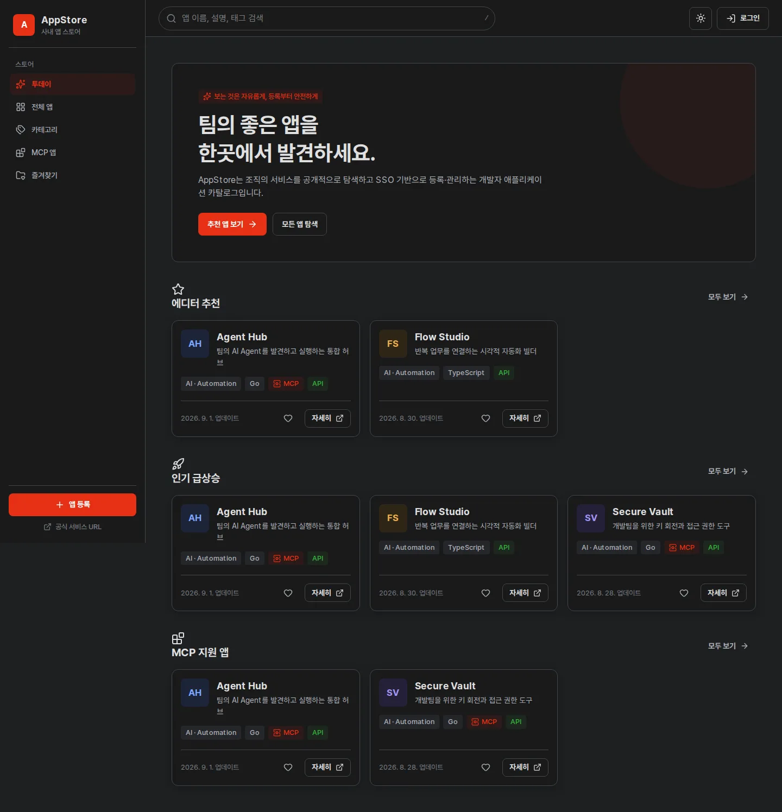

# AppStore

AppStore는 누구나 사내 애플리케이션을 탐색하고, 인증된 사용자가 앱을 등록·관리하며, 조직 정책에 따라 검토·승인할 수 있는 오프라인 운영형 Developer App Store입니다.

> 보는 것은 자유롭게, 등록하는 순간부터 인증하고, 관리 권한은 명확하게 분리합니다.



화면 이미지는 비밀이 없는 결정적 fixture로 생성한 v2.0.0 실제 UI의 전체 페이지 WebP 캡처입니다. Desktop·mobile 전체 route의 파일과 SHA-256은 [screenshot manifest](docs/assets/screenshots/manifest.json)에서 검증합니다.

## 핵심 기능

- 로그인 없는 Today, 앱 카탈로그, 카테고리, 검색, 상세와 즐겨찾기
- Keycloak Authorization Code + PKCE 기반 OIDC SSO와 discovery 연결 시험
- 개인 영역과 서비스 관리자 영역의 명확한 분리
- 기본 OFF인 선택형 팀장 검토·승인·반려 Workflow
- 원문을 저장하지 않는 개인 API·MCP Key와 회전 Grace Period
- 변경 가능한 역할, permission과 Key permission template
- REST API v1, OpenAPI 문서와 권한별 MCP tool
- SSE 기본 AI streaming, cancel 전파와 최대 262,144 token 설정
- URL 기반 메뉴·검색 상태, SPA refresh fallback과 전역 오류 상태
- 로그인 화면과 profile context menu의 build version 표시
- 감사 로그, 암호화된 OIDC·AI secret과 non-root container 운영

## 기술 구조

```text
Browser
  └─ React 19 + TypeScript + Vite + Tailwind CSS
       └─ Go HTTP service :8080
            ├─ React SPA (go:embed)
            ├─ REST / OpenAPI
            ├─ Keycloak OIDC session
            ├─ AI SSE proxy
            ├─ MCP endpoint
            └─ PostgreSQL migrations + seed (go:embed)
```

Frontend는 shadcn/ui의 소스 소유 방식과 접근성 원칙을 따르는 로컬 컴포넌트, Tailwind CSS, Lucide, TanStack Query 조합을 사용합니다. 런타임 CDN, Google Fonts와 원격 홍보 이미지를 사용하지 않습니다.

## 접근 정책

| 영역 | 정책 |
| --- | --- |
| `/`, `/today`, `/apps`, `/apps/:slug`, 카테고리·검색 | Anonymous |
| `/favorites` | Anonymous + Local Storage |
| `/submit`, `/my/*` | SSO |
| `/review` | SSO + Reviewer |
| `/admin/*` | SSO + Admin |

## 런타임 환경변수

애플리케이션 코드가 읽는 환경변수는 정확히 네 개입니다.

| 이름 | 필수 | 설명 |
| --- | --- | --- |
| `POSTGRES_DSN` | 예 | PostgreSQL 연결 문자열 |
| `BOOTSTRAP_ADMIN` | 예 | 최초·복구 Super Admin 식별자 |
| `BOOTSTRAP_ADMIN_PASSWORD` | 예 | 최소 12자의 Bootstrap 비밀번호 |
| `ENCRYPTION_KEY` | 예 | 32-byte secret 암호화 key. 64자리 hex 또는 32 byte의 base64 표현 권장 |

서비스 URL, OIDC Issuer·Client ID·Client Secret, role/group mapping, Workflow, AI, API, MCP와 Key 정책은 환경변수가 아니라 Admin UI와 PostgreSQL에서 관리합니다. Secret은 `ENCRYPTION_KEY`로 인증 암호화되고 조회 API에서는 원문을 반환하지 않습니다.

```bash
cp .env.example .env
chmod 600 .env
openssl rand -base64 32
```

`.env`의 placeholder를 실제 값으로 교체하세요. PostgreSQL password에 예약 문자가 있다면 DSN에서 URL encoding해야 합니다.

## 개발

### 준비물

- Go 1.25 이상
- Node.js 22 이상과 npm
- PostgreSQL
- E2E 실행 시 Playwright Chromium

### 빌드와 테스트

```bash
make web-install
make test
make check
make build VERSION=dev
```

Frontend 개발 서버는 `/api`와 `/mcp`를 `127.0.0.1:8080`으로 proxy합니다.

```bash
# terminal 1: 네 환경변수를 export한 뒤
go run ./cmd/server

# terminal 2
npm --prefix web run dev
```

전체 E2E는 다음과 같이 실행합니다.

```bash
npx --prefix web playwright install chromium
make test-e2e
```

## Docker 실행

Docker Compose는 PostgreSQL image를 포함하지 않습니다. `POSTGRES_DSN`이 가리키는 database를 먼저 준비하세요.

```bash
docker build \
  --build-arg VERSION=v2.0.0 \
  --build-arg COMMIT="$(git rev-parse HEAD)" \
  --build-arg BUILD_DATE="$(date -u +%Y-%m-%dT%H:%M:%SZ)" \
  -t appstore:v2.0.0 .

APPSTORE_VERSION=v2.0.0 docker compose up -d --no-build
```

`APPSTORE_VERSION`, `APPSTORE_COMMIT`, `APPSTORE_BUILD_DATE`는 Compose/build에서 image metadata를 선택하는 host-side 치환 값이며 application container에는 전달되지 않습니다. Container의 application environment 목록은 위 네 값뿐입니다.

상태 확인:

```bash
curl --fail http://127.0.0.1:8080/health/live
curl --fail http://127.0.0.1:8080/health/ready
curl --fail http://127.0.0.1:8080/api/version
```

## 오프라인 릴리스

안정 릴리스는 `vX.Y.Z` Git tag에서 생성합니다.

```text
Git tag       v2.0.0
Docker image  appstore:v2.0.0
Release file  appstore-v2.0.0.tar.gz
Platform      linux/amd64
```

로컬에서 같은 계약을 검증할 수 있습니다.

```bash
make archive VERSION=v2.0.0
make verify-archive VERSION=v2.0.0
./scripts/smoke-image.sh appstore:v2.0.0
```

태그를 push하면 Release workflow가 test, offline asset 검사, image build, archive 재로드, non-root 검사와 인터넷 egress 없는 smoke test를 수행합니다. 성공 시 AppStore service image archive 한 개만 custom asset으로 업로드하고 SHA-256을 release notes에 기록합니다. GitHub가 자동 제공하는 Source code zip/tar.gz 링크는 custom asset이 아니며 제거할 수 없습니다.

폐쇄망 반입과 실행 방법은 [오프라인 설치 가이드](docs/guides/offline/index.html)를 참고하세요.

## GitHub Pages와 가이드

`docs/`는 외부 asset 없이 동작하는 모바일 정적 홍보·운영 사이트입니다.

- [제품 안내](docs/index.html)
- [사용자 가이드](docs/guides/user/index.html)
- [관리자 가이드](docs/guides/admin/index.html)
- [오프라인 설치](docs/guides/offline/index.html)
- [업그레이드와 롤백](docs/guides/upgrade/index.html)
- [백업과 복구](docs/guides/backup/index.html)
- [릴리스 Runbook](docs/guides/release/index.html)

Pages는 canonical, Open Graph, WebApplication·FAQ JSON-LD, sitemap, robots, `llms.txt`, 키보드 접근성과 반응형 layout을 포함합니다. v2.0.0의 모든 React route를 desktop·mobile로 실제 캡처했으며 [screenshot manifest](docs/assets/screenshots/manifest.json)에 파일별 SHA-256을 기록합니다.

## 주요 경로

```text
cmd/server/                 Go entrypoint
internal/                   auth, API, AI, MCP, workflow, repository
internal/buildinfo/         ldflags build metadata
internal/webui/dist/        embedded React production output
migrations/                 embedded PostgreSQL migrations
web/                        React application and Playwright tests
scripts/                    release, offline, env and docs verification
.github/workflows/          CI, release and Pages automation
docs/                       static product site and operations guides
Dockerfile                  multi-stage React + Go non-root image
docker-compose.yml          external-PostgreSQL service deployment
```

## 보안 참고

- `.env`, DSN, password, API Key와 Client Secret을 commit하거나 image build argument로 전달하지 마세요.
- `ENCRYPTION_KEY`를 잃으면 database의 암호화된 secret을 복원할 수 없습니다. Database backup과 분리해 보관하세요.
- 개인 API Key 원문은 생성 직후 한 번만 표시됩니다.
- Release 전 database backup과 restore 시험을 수행하세요.
- Audit Log는 관리자에게도 삭제 기능을 제공하지 않는 정책을 기본으로 합니다.

## 라이선스

AppStore source는 [MIT License](LICENSE)로 배포됩니다. 제3자 구성요소 고지는 [NOTICE](NOTICE)를 확인하세요.
