# AppStore 사용자 가이드

대상 버전: **v2.6.1** · 실린 화면은 모두 이 버전을 실제로 띄워 찍은 것입니다.

운영자용 설치·설정 내용은 [관리자 가이드](ADMIN_GUIDE.md)에 있습니다. 이 문서는 화면을 쓰는 사람을 위한 것입니다.

---

## 1. 이 제품이 하는 일

AppStore는 조직 안에서 만든 서비스를 한곳에 모아 놓은 사내 앱 카탈로그입니다. 어떤 팀이 어떤 도구를 만들어 두었는지 사람에게 물어보지 않고 검색으로 찾고, 앱 카드의 **서비스 열기** 버튼으로 바로 그 서비스에 접속할 수 있습니다.

앱을 찾는 일에는 로그인이 필요하지 않습니다. 투데이, 전체 앱, 카테고리, MCP 앱, 앱 상세와 즐겨찾기는 인증 없이 열립니다. 회사 계정으로 로그인하는 것은 **내 것을 다룰 때**입니다 — 앱을 등록하거나, 내가 등록한 앱을 고치거나, 개인 API·MCP 키를 발급할 때만 SSO 인증을 요구합니다.

조직이 승인 워크플로를 켜 두었다면 등록한 앱은 바로 공개되지 않고 검토를 거칩니다. 이때 반려되면 반려 사유가 내 화면에 그대로 표시되고, 내용을 고쳐 저장하면 다시 검토 대기로 올라갑니다. 워크플로가 꺼져 있는 조직에서는 등록이 곧 게시입니다.

---

## 2. 처음 5분

로그인부터 앱 하나를 등록해 카탈로그에 올리기까지의 한 줄기 경로입니다.

### 2.1. 앱 둘러보기 (로그인 불필요)

브라우저에서 AppStore 주소를 엽니다. 처음 열리는 화면이 **투데이**입니다.

왼쪽 사이드바가 메뉴입니다. **스토어** 묶음에 투데이 · 전체 앱 · 카테고리 · MCP 앱 · 즐겨찾기가 있고, 로그인하면 **개인** 묶음이, 검토 권한이 있으면 **검토** 묶음이, 관리자면 **관리** 묶음이 아래에 더 붙습니다.

### 2.2. 로그인하기

사이드바 아래의 **+ 앱 등록**이나 개인 메뉴를 누르면 로그인 화면으로 이동합니다.

**회사 계정으로 SSO 로그인**을 누르면 조직의 Keycloak으로 이동해 인증하고, 끝나면 처음 누른 화면으로 그대로 돌아옵니다. 앱 등록에서 시작했다면 `/submit`으로 복귀합니다.

아래의 **관리자 계정으로 로그인**을 펼치면 사용자명·비밀번호 칸이 나옵니다. SSO를 아직 설정하지 않았거나 SSO에 장애가 있을 때 쓰는 복구용 계정이므로 일반 사용자는 쓰지 않습니다.

> 카드 맨 아래에 `AppStore v버전 · 커밋` 형태로 서비스 버전이 표시됩니다(위 화면의 값은 캡처용 시험 데이터입니다). 지원을 요청할 때 이 값을 함께 적어 주세요.

### 2.3. 앱 등록하기

**+ 앱 등록**을 누르면 등록 양식이 열립니다.

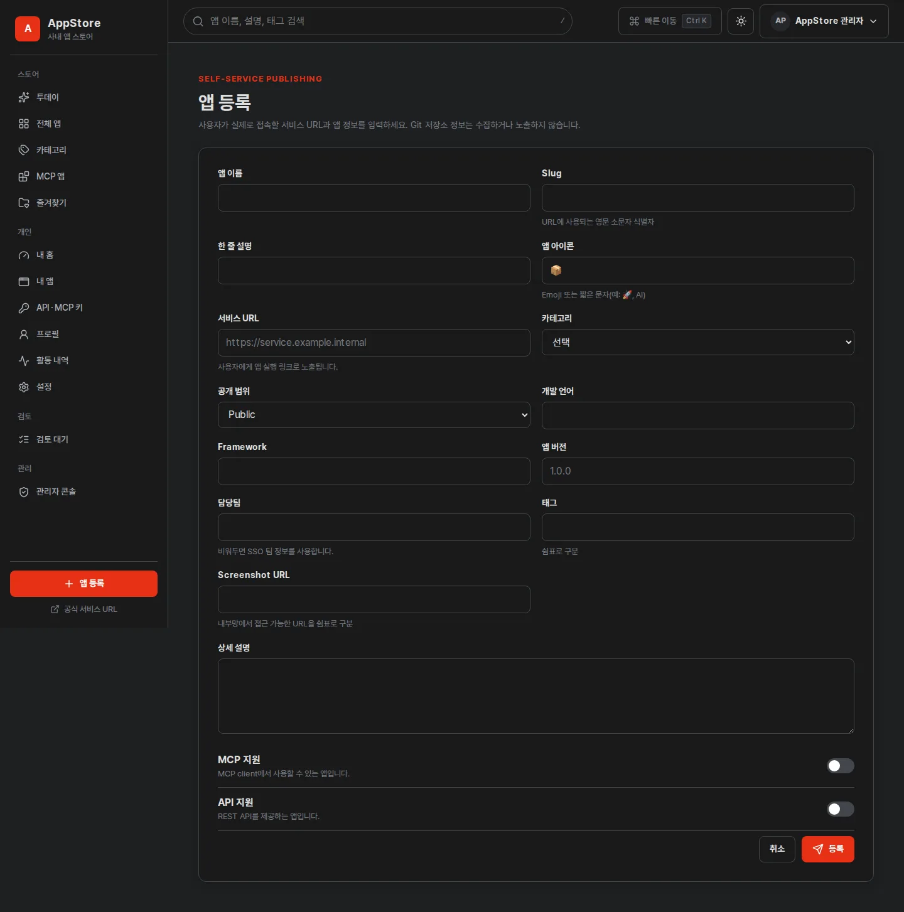

| 칸 | 넣는 값 |
| --- | --- |
| 앱 이름 | 사람이 부르는 이름. 2~120자 |
| Slug | *URL에 사용되는 영문 소문자 식별자.* 영문 소문자·숫자·하이픈으로 100자 이내 |
| 한 줄 설명 | 목록 카드에 보이는 요약. 2~240자 |
| 앱 아이콘 | *Emoji 또는 짧은 문자(예: 🚀, AI).* 기본값은 📦 |
| 서비스 URL | 사용자가 실제로 접속할 HTTP(S) 주소. *사용자에게 앱 실행 링크로 노출됩니다.* |
| 카테고리 | 목록에서 고릅니다 |
| 공개 범위 | `Public` 또는 `Private` |
| 개발 언어 · Framework · 앱 버전 · 태그 | 검색과 필터, 앱 상세에 쓰입니다. 태그는 쉼표로 구분 |
| 담당팀 | *비워두면 SSO 팀 정보를 사용합니다.* |
| Screenshot URL | *내부망에서 접근 가능한 URL을 쉼표로 구분* |
| 상세 설명 | 앱 상세 화면에 보이는 본문. 2~20,000자 |
| MCP 지원 · API 지원 | 실제로 제공할 때만 켭니다 |

Git 저장소 주소는 수집하지도, 노출하지도 않습니다.

**등록**을 누르면 *승인 Workflow 설정에 따라 즉시 게시되거나 검토 대기 상태가 됩니다.*

### 2.4. 결과 확인하기

**내 앱**(`/my/apps`)에서 방금 등록한 앱의 상태를 봅니다.

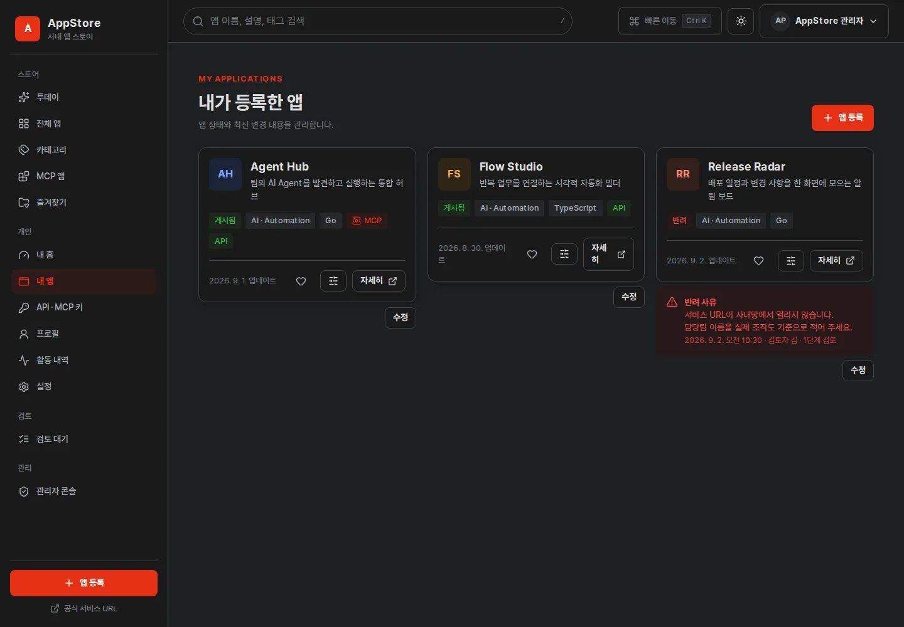

카드마다 첫 배지가 상태입니다 — **게시됨**, **검토 대기**, **반려**, **초안**, **보관됨**. 공개 카탈로그의 카드에는 이 배지가 없습니다(거기에는 게시된 앱만 있습니다). 몇 개가 게시됐고 몇 개가 검토 대기인지는 **내 홈**(`/my`)의 숫자 카드에서 한 번에 보고, 실제로 공개됐는지는 전체 앱에서 검색해 확인합니다. **반려된 앱만** 카드 아래에 반려 안내와 사유가 함께 표시됩니다 — 3.9 절을 보세요.

---

## 3. 화면별 사용법

### 3.1. 투데이

첫 화면입니다. 배너 아래에 **에디터 추천**(관리자가 정한 추천 앱)과 **인기 급상승**(인기 점수가 높은 앱)이 진열됩니다. 각 묶음의 **모두 보기**를 누르면 같은 조건이 걸린 전체 앱 목록으로 넘어갑니다.

오른쪽 위 해 모양 버튼으로 라이트/다크 테마를 바꿉니다.

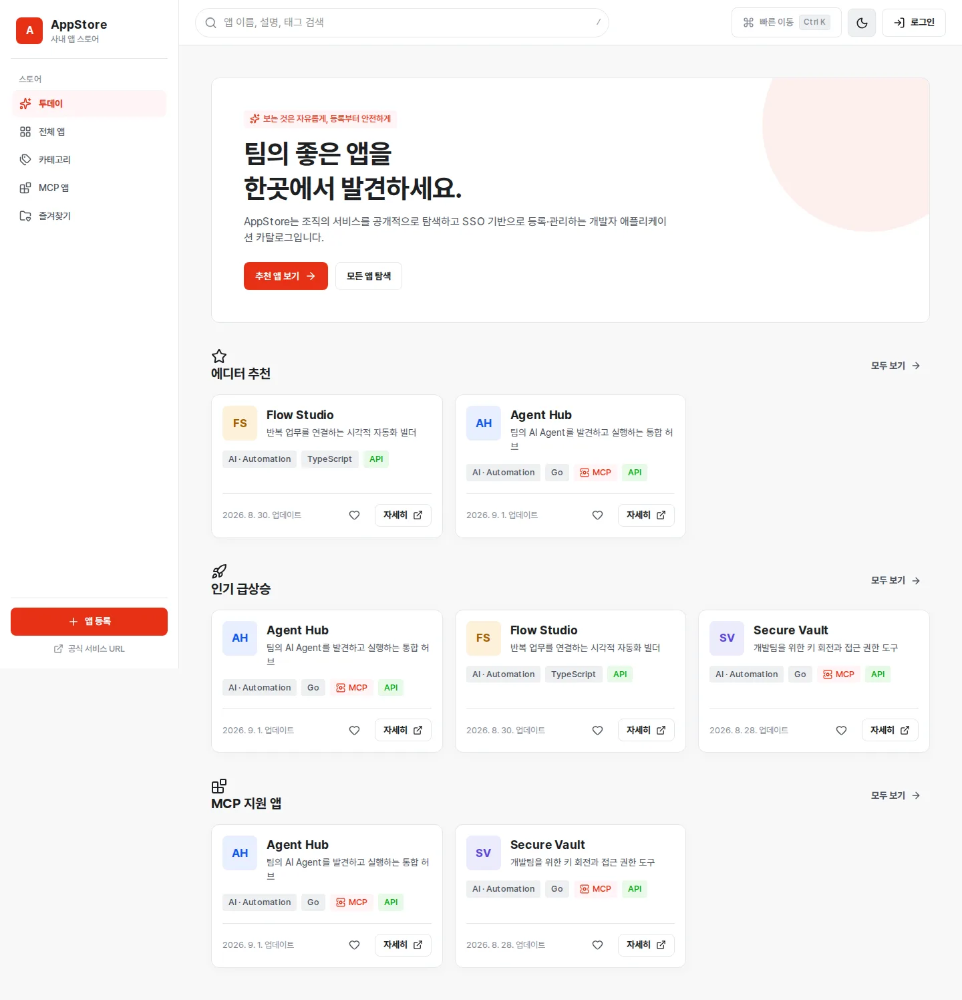

### 3.2. 전체 앱

공개된 앱 전부를 검색·필터·정렬해 보는 화면입니다.

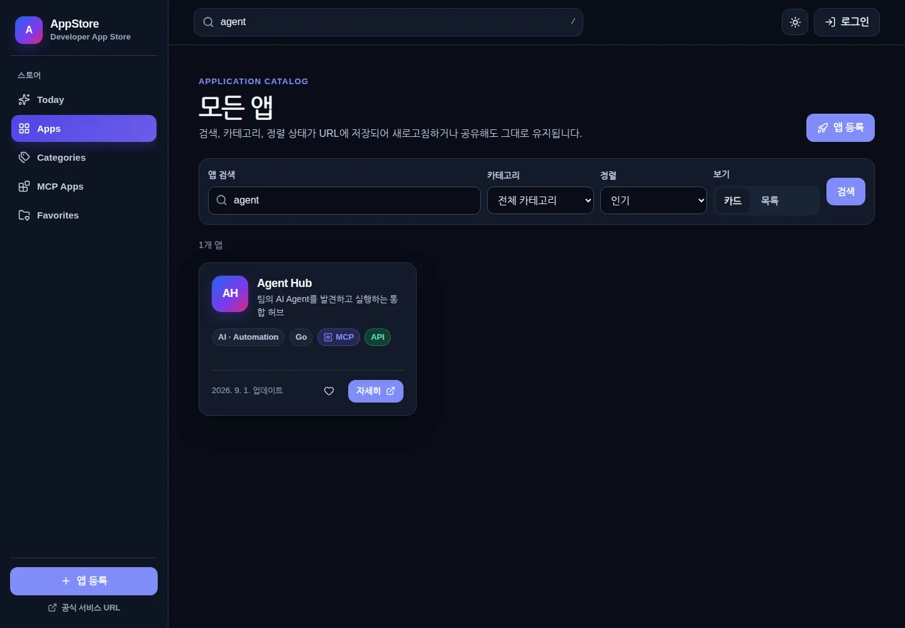

- 상단 검색창은 **이름, 설명, 태그**에서 찾습니다.
- 필터: 카테고리, 언어, 지원 기능(MCP·API), 추천.
- 정렬: 인기 · 최근 업데이트 · 최근 등록 · 이름 · 추천 우선순위.
- 보기 방식: **카드** 또는 **목록**.
- **검색, 카테고리, 정렬 상태가 URL에 저장되어 새로고침하거나 공유해도 그대로 유지됩니다.** 지금 보고 있는 화면 그대로 동료에게 주소를 보내면 됩니다.
- 조건에 맞는 앱이 없으면 **필터 초기화**로 되돌립니다.

### 3.3. 카테고리

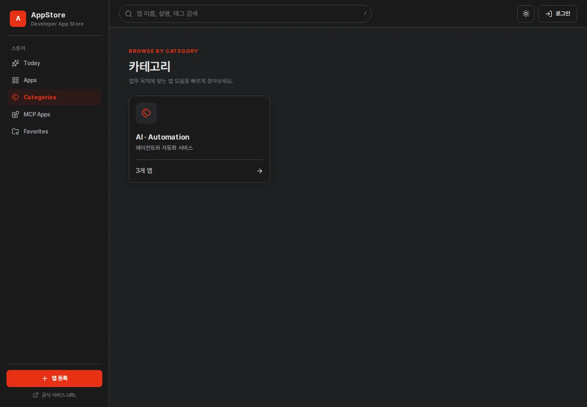

카테고리 카드를 누르면 그 카테고리로 좁힌 앱 목록이 열립니다.

### 3.4. MCP 앱

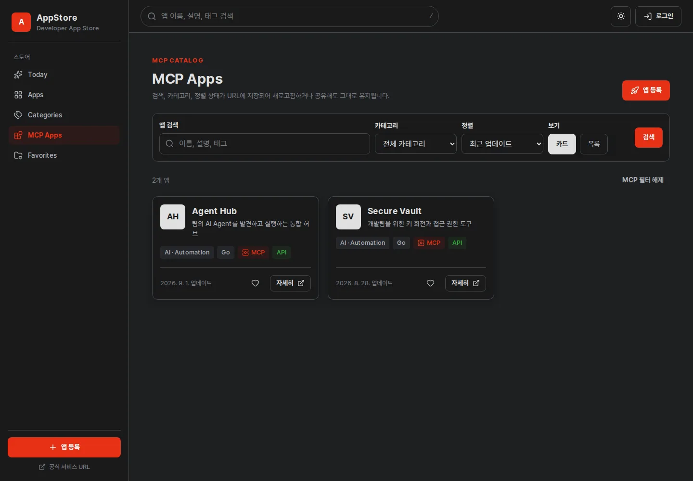

MCP 클라이언트에 연결해 쓸 수 있는 앱만 모아 보는 화면입니다. 전체 앱 화면에서 지원 기능 필터를 MCP로 두는 것과 같습니다.

### 3.5. 앱 상세

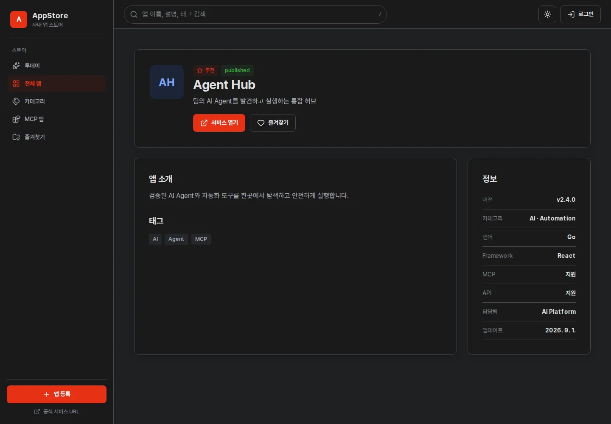

왼쪽에 **앱 소개**와 **태그**가, 오른쪽 **정보** 카드에 버전 · 카테고리 · 언어 · Framework · MCP · API · 담당팀 · 업데이트 시각이 있습니다. **서비스 열기**로 실제 서비스에 접속하고, 옆의 **즐겨찾기** 버튼으로 담아 둡니다. 등록자가 서비스 URL을 아직 넣지 않았다면 버튼 대신 **서비스 URL 준비 중**이 표시됩니다.

### 3.6. 즐겨찾기

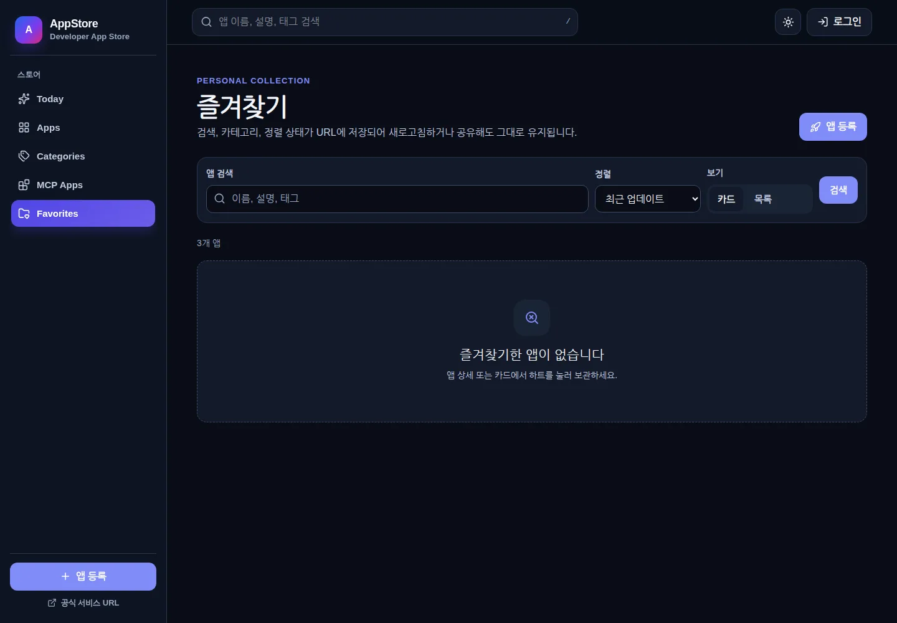

로그인하지 않아도 쓸 수 있습니다. 다만 **비로그인 즐겨찾기는 지금 쓰는 브라우저에 저장**되므로 브라우저 데이터를 지우거나 다른 기기에서 열면 남아 있지 않습니다.

### 3.7. 빠른 이동 (Ctrl/Cmd + K)

상단의 **빠른 이동 `Ctrl K`** 버튼이나 단축키로 팔레트를 엽니다. 메뉴 이름과 앱 이름을 함께 검색해 한 번에 이동합니다. 관리자라면 스토어에 있으면서도 관리 화면으로 바로 건너뛸 수 있습니다.

### 3.8. 내 홈

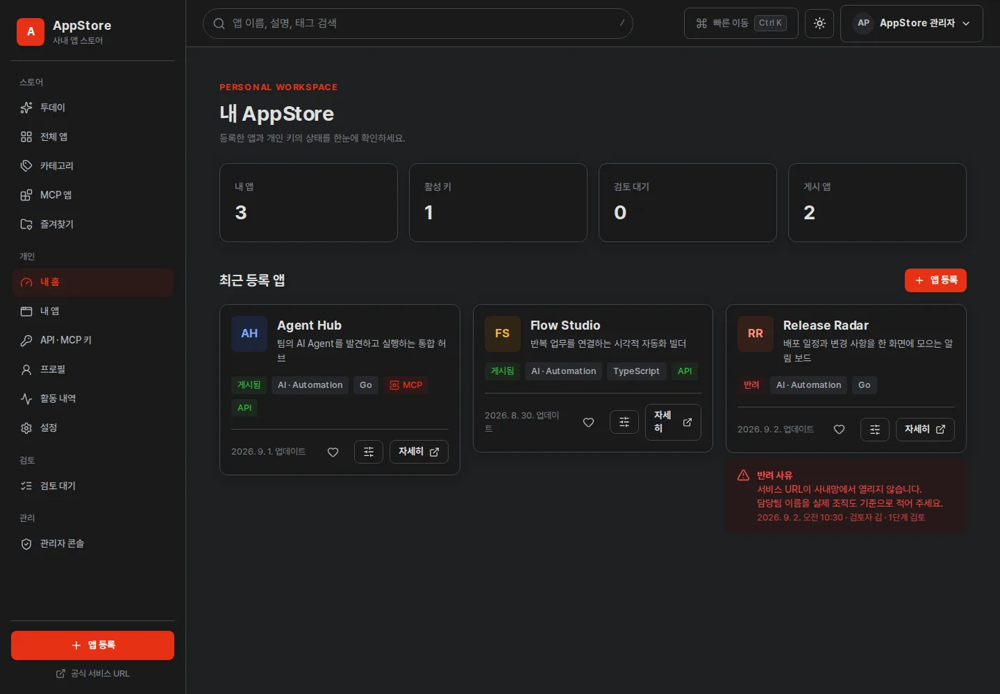

숫자 카드 네 개 — **내 앱**, **활성 키**, **검토 대기**, **게시 앱** — 와 최근 등록 앱 세 개를 봅니다. 여기의 카드에도 내 앱과 같은 상태 배지가 붙습니다. 등록한 앱이 없으면 **첫 앱 등록**, 발급한 키가 없으면 **첫 키 만들기** 버튼이 나옵니다. 반려된 앱이 있으면 여기에서도 카드 아래에 반려 안내가 붙습니다.

### 3.9. 내 앱과 앱 수정

내 앱 목록에서 **수정**을 누르면 등록 때와 같은 양식이 열립니다.

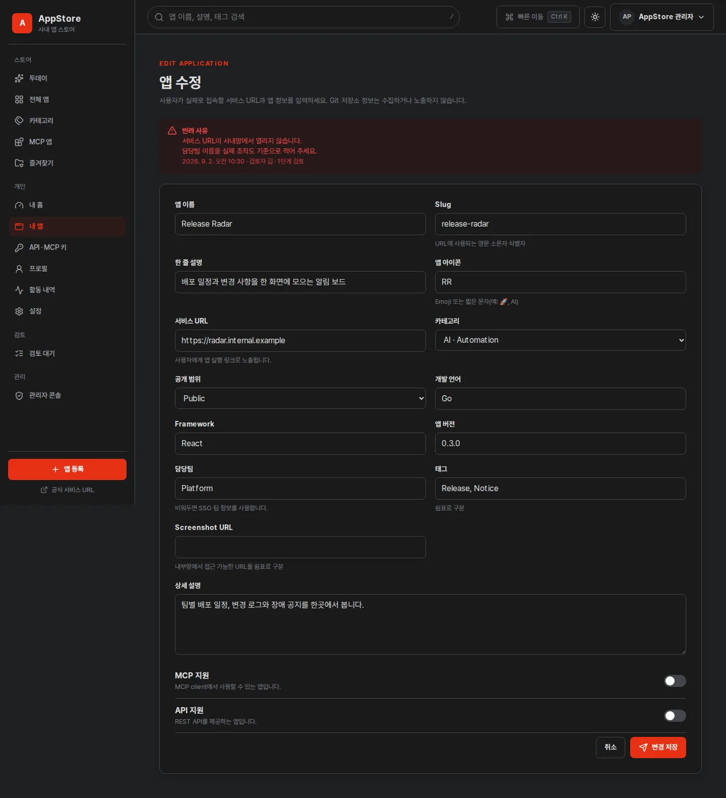

**변경 저장**으로 저장합니다. 소유자와 관리자만 수정·삭제할 수 있습니다.

앱이 반려된 상태라면 내 앱 카드 아래, 내 홈, 그리고 이 수정 화면 위쪽에 **반려됨** 안내가 뜨고 그 안에 **반려 사유**와 결정 시각·검토자·몇 단계 검토였는지가 함께 적혀 있습니다. 사유가 비어 있으면 *사유가 기록되지 않았습니다. 검토자에게 문의하세요.* 라고 표시됩니다.

승인 워크플로가 켜진 조직에서는 반려된 앱을 고쳐 저장하는 것만으로 다시 검토 대기 상태가 됩니다. 따로 재제출 버튼을 누를 필요가 없습니다.

### 3.10. API · MCP 키

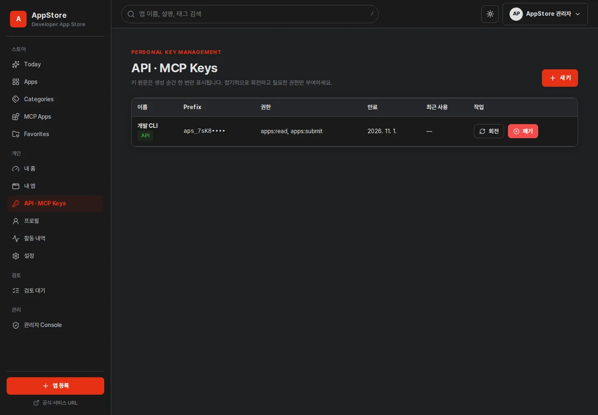

목록에는 키 원문이 아니라 **Prefix**(예: `aps_7sK8••••`), 권한, 만료일, 최근 사용 시각만 보입니다. 서버는 원문을 저장하지 않으므로 다시 보여 줄 수 없습니다.

- **+ 새 키** — 키 이름, 키 유형(API 또는 MCP), 권한을 고릅니다. 권한은 관리자가 만든 템플릿(Read Only, Developer, AI Client, MCP Client, Full Access)에서 고르거나 **직접 선택**합니다. *용도에 필요한 최소 권한만 선택하세요.*
- 생성 직후 원문이 한 번 표시됩니다. *지금 키를 복사하세요. 닫으면 다시 볼 수 없습니다.* — **복사**를 눌러 조직이 승인한 비밀 저장소에 옮긴 다음 닫습니다.
- **회전** — 새 키를 만들고 기존 키는 관리자가 정한 회전 유예 기간 동안만 더 받아 줍니다. 클라이언트 설정을 새 키로 바꿔 확인한 뒤 옛 키를 폐기하세요.
- **폐기** — 즉시 무효가 됩니다. 유출이 의심되면 유예를 기다리지 말고 바로 폐기합니다.

키를 URL 쿼리, 브라우저 저장소, 소스 코드, 앱 설명, 스크린샷에 넣지 마세요. HTTP `Authorization` 헤더로 보냅니다.

### 3.11. 프로필 · 활동 내역 · 설정

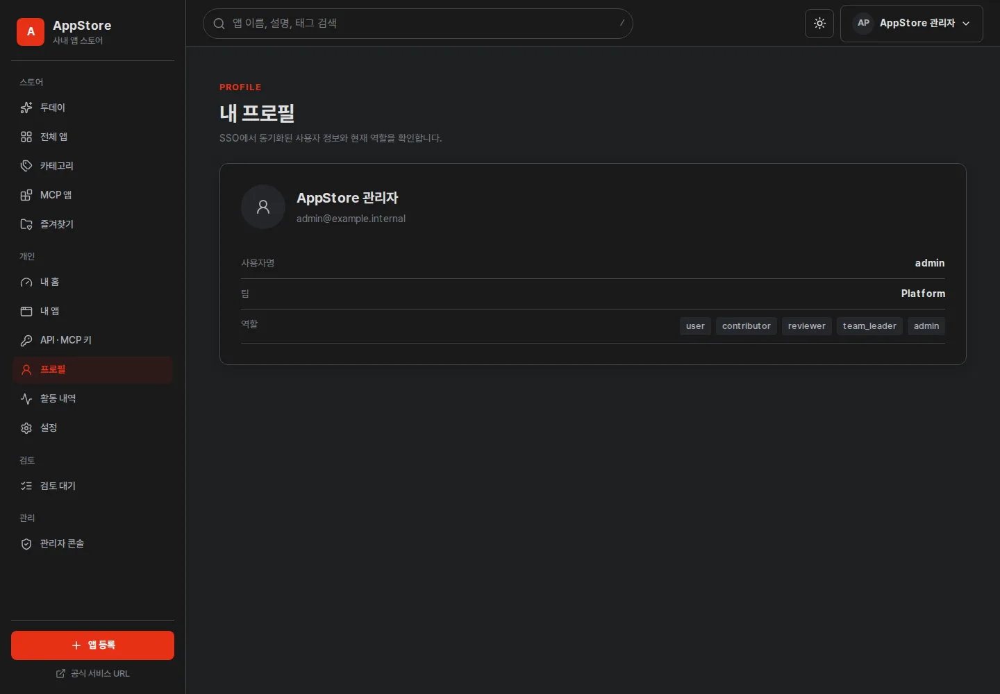

프로필에는 사용자명, 이메일, 표시 이름과 현재 **역할**이 나옵니다. 역할은 여기서 바꿀 수 없습니다 — 조직의 SSO 역할 매핑과 관리자가 정합니다.

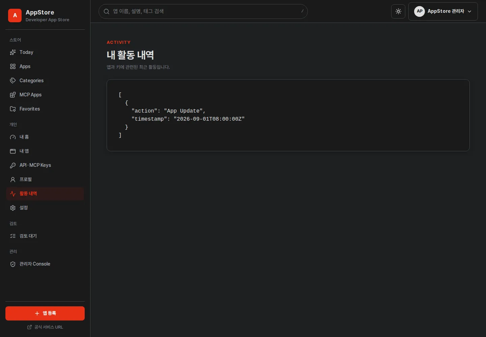

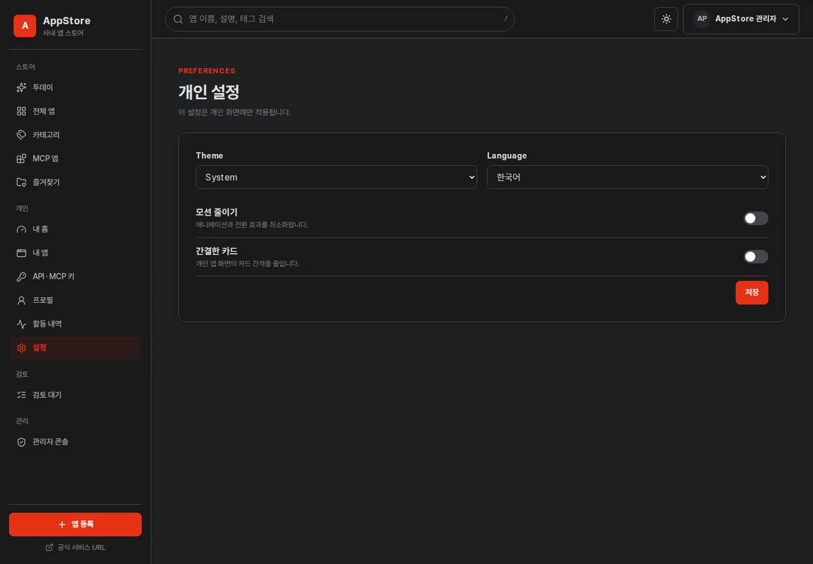

**Theme**(System·Light·Dark)과 **Language**를 고르고, **모션 줄이기**(*애니메이션과 전환 효과를 최소화합니다.*)와 **간결한 카드**(*개인 앱 화면의 카드 간격을 줄입니다.*)를 켜고 끕니다. **저장**을 눌러야 반영됩니다. *이 설정은 개인 화면에만 적용됩니다.*

### 3.12. 검토 대기 (검토자 역할일 때만)

Reviewer 또는 Team Leader 역할을 받은 사람에게만 사이드바에 **검토** 묶음이 나타납니다.

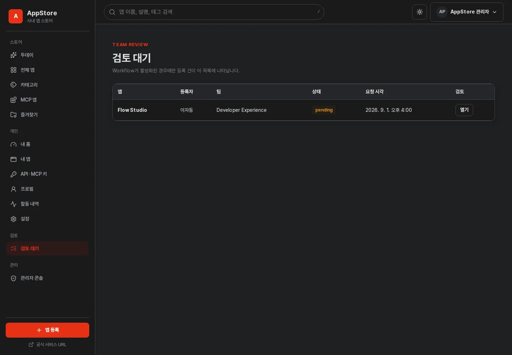

목록은 앱 이름 · 등록자 · 담당팀 · 상태 · 요청 시각을 보여 주고, 행 끝의 **열기**로 검토 상세로 들어갑니다.

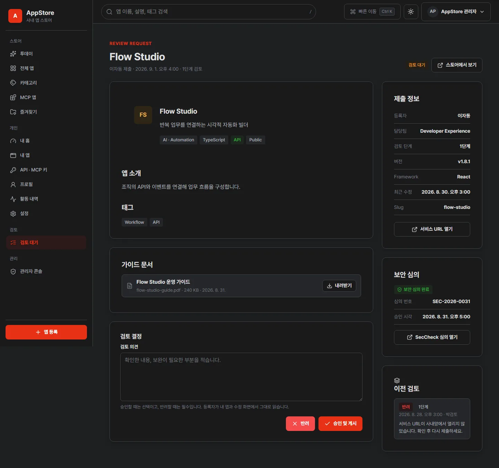

- **검토 정보** — 앱 ID, 등록자, 담당팀, 그리고 **이전 사유**(앞선 검토에서 남긴 반려 사유. 없으면 `—`)를 확인합니다.
- **승인 및 게시** — 확인 창(*이 앱을 승인하고 게시할까요?*)을 거쳐 승인합니다. 다단계 검토라면 다음 단계로 넘어갑니다.
- **반려** — 반려 사유를 적고 **반려 확정**을 누릅니다. *등록자가 수정할 수 있도록 구체적인 사유를 입력하세요.* 여기 적은 글이 등록자 화면에 그대로 보입니다. 사유는 2,000자까지 쓸 수 있습니다.

*Workflow가 활성화된 경우에만 등록 건이 이 목록에 나타납니다.* 목록이 비어 있으면 **모든 등록 요청을 처리했습니다.** 라고 표시됩니다.

---

## 4. 자주 하는 작업

### 4.1. 우리 팀 도구를 카탈로그에 올리기

1. **+ 앱 등록**에서 앱 이름·Slug·한 줄 설명·상세 설명·서비스 URL·카테고리를 채웁니다.
2. 사내에서 실제로 접속되는 주소인지 서비스 URL을 한 번 열어 확인합니다.
3. MCP나 API를 실제로 제공할 때만 해당 스위치를 켭니다.
4. **등록**을 누릅니다.
5. **내 앱**의 카드 배지로 게시됐는지 검토 대기인지 확인합니다. 검토 대기라면 담당 검토자에게 알리고, 게시됐다면 전체 앱에서 검색해 보이는지 확인합니다.

### 4.2. 반려된 앱을 다시 올리기

1. **내 앱**에서 반려됨 안내의 **반려 사유**를 읽습니다.
2. **수정**을 눌러 지적된 부분을 고칩니다.
3. **변경 저장**을 누릅니다. 승인 워크플로가 켜져 있으면 저장과 동시에 다시 검토 대기가 되고, 검토는 1단계부터 다시 시작합니다.
4. 내 앱으로 돌아가 반려 안내가 사라졌는지, 내 홈의 **검토 대기** 수가 늘었는지 확인합니다.

### 4.3. 자동화 스크립트에 쓸 키 발급받기

1. **API · MCP 키 → + 새 키**.
2. 스크립트 이름을 그대로 키 이름으로 씁니다(예: `배포 알림 봇`).
3. 권한은 하는 일에 맞는 템플릿 하나만 고릅니다. 조회만 한다면 **Read Only**입니다.
4. 표시된 원문을 비밀 저장소에 넣고 대화 상자를 닫습니다.
5. `Authorization` 헤더에 넣어 `/api/v1` 또는 `/mcp`를 호출합니다.
6. 만료가 다가오면 **회전** → 클라이언트 교체 → 옛 키 **폐기** 순서로 무중단 교체합니다.

### 4.4. 자주 쓰는 앱 모아 두기

앱 카드나 앱 상세의 하트를 누르면 **즐겨찾기**에 담깁니다. 사이드바의 즐겨찾기에서 한 번에 봅니다. 다른 기기에서도 같게 보이게 하려면 로그인한 상태로 담으세요.

### 4.5. 지금 보고 있는 목록을 동료에게 보내기

검색어·필터·정렬·페이지가 모두 주소에 들어 있으므로, 브라우저 주소창을 그대로 복사해 보내면 상대도 같은 화면을 봅니다.

---

## 5. 막혔을 때

화면에 실제로 나오는 문구별로 정리했습니다.

| 화면에 나오는 문구 | 뜻과 할 일 |
| --- | --- |
| **로그인이 필요합니다** — 회사 계정으로 로그인하면 이 화면을 계속 이용할 수 있습니다. | 세션이 만료됐거나 로그인 없이 개인 화면을 열었습니다. 로그인하면 원래 화면으로 돌아옵니다. |
| **접근 권한이 없습니다** — 필요한 역할 또는 권한이 있는지 관리자에게 확인해 주세요. | 로그인은 됐지만 역할이 부족합니다(403). 관리자에게 필요한 역할을 요청하세요. |
| **페이지를 찾을 수 없습니다** — 주소가 변경되었거나 존재하지 않는 화면입니다. | 주소 오타이거나 앱이 삭제·보관됐습니다. **스토어 홈**으로 돌아가 검색해 보세요. |
| **화면을 불러오지 못했습니다** + `요청 ID …` | 서버 호출이 실패했습니다. **다시 시도**를 누르고, 반복되면 요청 ID를 그대로 적어 관리자에게 전달하세요. |
| **예기치 않은 화면 오류가 발생했습니다** | 화면 자체가 멈췄습니다. **새로고침**을 누릅니다. 입력하던 내용은 남지 않을 수 있습니다. |
| **요청이 너무 많습니다. 잠시 후 다시 시도하세요.** | 분당 요청 한도(429)에 걸렸습니다. 잠시 뒤 다시 시도하고, 스크립트라면 응답의 `Retry-After` 초만큼 기다리게 하세요. |
| **로그인 시도가 너무 많습니다. 잠시 후 다시 시도하세요.** | 관리자 로그인 시도 한도입니다. 잠시 뒤 다시 시도합니다. |
| **관리자 이름 또는 비밀번호가 올바르지 않습니다.** | 복구용 관리자 로그인 실패입니다. 일반 사용자는 **회사 계정으로 SSO 로그인**을 쓰세요. |
| **SSO가 아직 설정되지 않았습니다.** / **SSO 공급자에 연결할 수 없습니다.** | 조직의 SSO 연동 문제입니다. 사용자가 고칠 수 없습니다 — 관리자에게 알리세요. |
| **SSO 요청이 만료되었거나 이미 사용되었습니다.** | 로그인 화면을 오래 열어 두었거나 뒤로 가기로 되돌아왔습니다. 같은 탭에서 처음부터 다시 로그인합니다. |
| **유효한 HTTP(S) 서비스 URL을 입력하세요.** | 서비스 URL이 `http://` 또는 `https://`로 시작해야 합니다. |
| **영문 소문자, 숫자, 하이픈으로 100자 이내로 입력하세요.** | Slug 형식 오류입니다. 대문자·공백·한글을 뺍니다. |
| **제어 문자는 사용할 수 없습니다.** | 다른 곳에서 붙여 넣은 보이지 않는 문자가 섞였습니다. 메모장을 거쳐 다시 붙여 넣으세요. |
| **같은 값이 이미 존재하거나 현재 상태에서 처리할 수 없습니다.** | 식별자가 이미 쓰이고 있거나, 이미 처리된 검토를 다시 처리하려 했습니다. |
| **키 이름을 1~100자로 입력하세요.** | 개인 키 이름 길이 제한입니다. |
| **소유한 앱만 수정할 수 있습니다.** | 남의 앱입니다. 수정이 필요하면 등록자나 관리자에게 요청하세요. |
| **자동화 API가 비활성화되어 있습니다.** / **익명 AppStore 탐색이 비활성화되어 있습니다.** | 관리자가 해당 기능을 꺼 두었습니다. 관리자에게 문의하세요. |
| **사용 가능한 AI Provider가 없습니다.** | AI 기능이 설정되지 않았습니다. 관리자 영역의 설정입니다. |

지원을 요청할 때는 **발생 시각 · 화면 주소 · 서비스 버전 · 요청 ID**를 함께 적고, 키 원문이나 비밀번호는 절대 적지 마세요.

---

## 6. 용어

| 말 | 뜻 |
| --- | --- |
| **Slug (식별자)** | 앱 주소에 쓰이는 영문 소문자 이름. `/apps/agent-hub`의 `agent-hub` 부분 |
| **게시됨 / 검토 대기 / 반려됨 / 초안 / 보관됨** | 앱의 상태. 게시됨만 공개 카탈로그에 보입니다. 보관됨은 카탈로그에서 내려갔지만 기록은 남아 있는 상태입니다 |
| **승인 워크플로** | 등록한 앱을 검토자가 승인해야 게시되도록 하는 선택 기능. 기본값은 꺼짐이며 관리자가 켭니다 |
| **회전 (Rotate)** | 키를 새로 발급하고 옛 키를 유예 기간 뒤 무효화하는 것. 서비스를 멈추지 않고 키를 바꾸는 방법 |
| **회전 유예 (Grace Period)** | 회전한 뒤 옛 키가 아직 받아들여지는 기간. 관리자가 정합니다 |
| **Prefix** | 키의 앞부분만 보여 주는 식별 문자열. 어느 키인지 구분하는 용도이며 인증에는 쓸 수 없습니다 |
| **MCP** | Model Context Protocol. AI 클라이언트가 앱의 기능을 도구로 불러 쓰는 규격. 이 서비스의 endpoint는 `/mcp`입니다 |
| **요청 ID (Request ID)** | 실패한 요청 하나를 서버 로그에서 찾아낼 수 있는 식별자. 오류 화면에 표시됩니다 |
| **역할 (Role)** | User · Contributor · Reviewer · Team Leader · Admin · Super Admin. 무엇을 할 수 있는지 정합니다 |
| **SSO** | 회사 계정 하나로 로그인하는 방식. 이 서비스는 Keycloak OIDC를 씁니다 |

---

## 더 읽을 것

- [관리자 가이드](ADMIN_GUIDE.md) — 설치, 환경 변수, 역할 매핑, 워크플로, 운영
- [오프라인 설치](guides/offline/index.html) · [업그레이드와 롤백](guides/upgrade/index.html) · [백업과 복구](guides/backup/index.html)
- REST API 문서는 서비스의 `/docs`에서, OpenAPI 문서는 `/openapi.json`에서 볼 수 있습니다.
